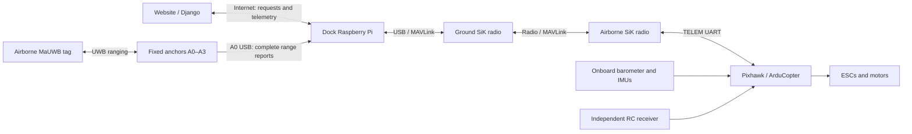

# ADR-0001: Ground-based UWB localization with SiK telemetry and ArduPilot flight control

Project Helios adopts the Holybro S500 V2 development kit, Makerfabs MaUWB ranging, a dock-side Raspberry Pi, and a SiK telemetry pair. The Pi calculates horizontal position; Pixhawk running ArduCopter combines external X/Y with onboard barometric altitude and inertial sensing, then controls flight to a requested 3D waypoint. This keeps localization and mission supervision accessible on the ground while the aircraft retains its flight-control loops.

Accepted means the architecture is selected, not that hardware integration or flight performance has been demonstrated. The user's written request establishes the decision; the supplied diagram is supporting context. Implementation defaults below fill gaps in that request and require qualification rather than being treated as manufacturer guarantees.

## Scope and precedence

This decision supersedes conflicting recommendations in the [system plan](../planning/system-plan.md), [roadmap](../project-roadmap.md), and earlier localization research: PX4 becomes ArduCopter, the provisional small aircraft becomes the S500 V2/Pixhawk platform, the Wi-Fi MAVLink bridge becomes SiK, and UWB-derived 3D position becomes UWB X/Y plus onboard barometric Z. A downward rangefinder is not part of this altitude baseline.

The first deployment is one aircraft, one dock, and one surveyed indoor flight volume. The website/Django submits destinations and displays telemetry; internet availability does not sustain stabilization or localization. Automatic precision docking, obstacle avoidance, and tightly accurate floor clearance are not established by this decision. Manual charging remains unchanged.

## Hardware and connections

| Item | Baseline quantity and role | Detail |
| --- | --- | --- |
| Holybro S500 V2 development kit | 1 aircraft | Current listing includes Pixhawk 6C, PM02 V3 power module, M10 GPS, SiK V3 telemetry, frame, motors, ESCs, and propellers. Use ArduCopter firmware. |
| MaUWB Direct | 1 airborne tag | Implementation default: configure as a tag, mount securely with clear antenna exposure, and qualify power endurance. |
| MaUWB ESP32S3 | 4 fixed anchors | Implementation default: anchors A0–A3, with A0 also serving as the USB collector. All four participate in ranging. |
| Raspberry Pi | 1, permanently at dock | Retain Pi 4 Model B / 4 GB as the planning default; provide regulated power, storage, cooling, network access, and service supervision. |
| SiK radios | 1 matched pair | Ground radio via USB to Pi; airborne radio via a verified TELEM UART cable to Pixhawk. Confirm that the purchased kit supplies both ends. |
| Supporting equipment | As required | Flight battery and balance charger, independent RC transmitter/receiver, anchor power supplies, USB data cables, rigid mounts, tag power/mount, and landing platform. |

The [Holybro listing](https://holybro.com/products/s500-v2-development-kit?variant=43018359832765) recommends a 4S 3000–5000 mAh battery, which is not included. The exact mapping of variant `43018359832765` to radio frequency was not verified; record the ordered SKU, board revision, and radio band before purchase. Final delivered cost and room suitability must be recalculated for this aircraft rather than inherited from the earlier small-drone budget.

The [MaUWB Direct](https://www.makerfabs.com/mauwb-direct.html) supports tag or anchor operation with USB configuration and includes a battery; its listed mass is 50 g. The [ESP32S3 module](https://www.makerfabs.com/mauwb-esp32s3-uwb-module.html) contains a programmable host controller around the MaUWB ranging subsystem. This role allocation uses both selected products; swapping their roles requires checking mass, power, and collector output, not changing the architecture. Generic ESP32/DW3000 boards are not assumed protocol-compatible.



The SiK link is bidirectional: it carries position observations and waypoint commands toward the aircraft, and altitude, attitude, estimator health, battery status, and command results back to the Pi. UWB is the ranging network; SiK is the aircraft telemetry transport. Verify each connector's pinout, supply voltage/current, UART logic levels, and port assignment before wiring; USB and TELEM are not electrically interchangeable.

## Ranging and horizontal localization

Makerfabs' [v1.1.6 update-frequency test](https://www.makerfabs.com/blog/post/mauwb-update-frequency-test) documents identical system output at all anchors. It also explains that configured tag capacity and slot duration determine per-tag update rate, and that v1.1.6 removes RSSI from range output. Therefore one collector is supported in principle, but commissioning must prove that the selected firmware on all five devices produces all four ranges for the correct tag through A0. Do not assume the older ESP32 JSON demonstration is the stock serial format.

Our implementation requirements are:

- Pin a compatible MaUWB firmware set and ESP32 forwarding sketch; start qualification with the documented v1.1.6 protocol or a verified successor. Configure one active tag, consistent network settings, and unique anchor IDs. Record baud rates at both the MaUWB-to-ESP32 and USB-to-Pi interfaces.
- Survey anchor antenna coordinates `(x_i, y_i, z_i)` in metres, calibrate antenna delays/range bias, and version the survey. Distribute anchors around the operating area with useful horizontal separation. Known-height X/Y estimation does not require non-coplanar anchors, but geometry and occlusion must be tested across the entire volume.
- Require four valid ranges for the initial flight baseline. Three well-placed anchors can constrain X/Y with known height, but degraded three-anchor flight is not enabled until separately qualified. Extra installed anchors do not automatically count as usable measurements.
- Preserve tag/anchor IDs, source sequence/timestamps where available, receive times, validity, and raw records. Reject incomplete, stale, duplicated, impossible, or inconsistent data. If firmware supplies no measurement timestamp, characterize acquisition delay and include that uncertainty; receive time is not proof of measurement time.

UWB measures slant range, not horizontal distance. For a known tag height `z_tag`, solve only `(x, y)` using a robust weighted least-squares fit:

```text
predicted_range_i = sqrt((x - x_i)^2 + (y - y_i)^2 + (z_tag - z_i)^2)
residual_i        = predicted_range_i - calibrated_measured_range_i
```

The Pi receives the barometer-aided flight-controller altitude over SiK and transforms it into the anchor survey's height datum. Time-align that altitude with each ranging epoch. Include height uncertainty in horizontal uncertainty; do not substitute desired waypoint height for measured height. Stale altitude makes the horizontal solution invalid for flight unless a separately tested bounded prediction is available.

Record the tag-to-vehicle-reference offset. Use time-aligned attitude to transform that offset when converting antenna position to aircraft position. Compensate once, either in the Pi or through the validated flight-controller sensor-offset configuration. Do not silently identify a tilted, offset antenna with the vehicle centre.

## Z altitude, heading, and coordinate contract

ArduCopter's estimator owns Z using its onboard barometer with inertial propagation. The Pi does not independently integrate pressure or replace Z with UWB. The [EKF source documentation](https://ardupilot.org/copter/docs/common-ekf-sources.html) allows barometric vertical position and compass heading alongside other horizontal sources.

Barometric altitude is relative to a reference pressure and can drift; it is not a direct measurement of distance to the floor, obstacles, or landing platform. Establish the altitude reference while stationary after sensor warm-up. Measure its repeatability and drift with motors running. A failed vertical-accuracy test requires changing operating limits or revisiting sensing; it must not be hidden by reporting the target as the actual height.

Define the application frame as local east/north/up: `X = east`, `Y = north`, `Z = up`, metres, with origin at the surveyed dock reference. Room drawings may use another orientation only through a stored rigid transform. The aircraft reference point's height while resting on the dock is a measured offset from that origin, not automatically zero.

For navigation convert to local NED: `(north, east, down) = (Y, X, -Z)`, including the stored offset between dock origin and EKF origin. Keep altitude above dock, altitude above home, and altitude relative to EKF origin distinct. Version frame/survey calibration and reject commands referencing a different version. Never reset the coordinate frame while armed.

One tag does not observe yaw. Use a calibrated, supported compass as the baseline heading source; verify its physical availability and indoor performance on the assembled kit. Match frame north to the estimator's heading convention. Magnetic interference that prevents reliable heading blocks waypoint flight until the heading solution is revised.

## External-navigation integration

Use MAVLink 2 and `VISION_POSITION_ESTIMATE` as the initial position-only adapter. ArduPilot supports this message at 4 Hz or higher; it prefers `ODOMETRY` for fuller estimates. Establish the EKF origin before non-GPS navigation. Initial settings to validate on the pinned ArduCopter build are:

| Parameter | Intended value |
| --- | --- |
| `VISO_TYPE` | `3` (MAVLink/VOXL backend) |
| `EK3_SRC1_POSXY` | `6` (ExternalNav) |
| `EK3_SRC1_VELXY` | `0` (no external velocity) |
| `EK3_SRC1_POSZ` | `1` (Baro) |
| `EK3_SRC1_VELZ` | `0` (no external vertical velocity) |
| `EK3_SRC1_YAW` | `1` (Compass) |

These selections are based on [ArduPilot's external-navigation interface](https://ardupilot.org/dev/docs/mavlink-nongps-position-estimation.html). Enable EKF3 and the correct TELEM MAVLink port; capture the complete tested parameter file, firmware version, source-set selection, sensor offsets, and delay/noise configuration. Indoor operation must not silently switch to GPS.

The message adapter sends measured X/Y in the aligned navigation frame, a consistent Z field from aircraft telemetry, and time-aligned aircraft attitude for required pose fields. Those returned Z/attitude fields are not independent observations: external Z and yaw fusion stay disabled. No external velocity message is sent. Validate this separation in estimator logs before flight.

Use real acquisition timing, estimated covariance, and a reset counter, following the [MAVLink message definition](https://mavlink.io/en/messages/common.html#VISION_POSITION_ESTIMATE). Avoid zero covariance implying certainty. Inflate uncertainty for poor geometry, height uncertainty, and measurement skew. Lost data must not be republished with fresh timestamps. A service restart invalidates its session and blocks automatic command replay.

As project qualification targets, start with 20 fresh usable X/Y estimates per second and 95th-percentile acquisition-to-flight-controller latency under 100 ms. These are unverified targets, not product specifications or sufficient proof of safe flight. Also measure worst gaps and downlink altitude age; choose final freshness limits from measured stopping distance and flight envelope. If the target fails, reduce the qualified envelope or revise transport/configuration before flight.

Budget radio airtime for both directions, heartbeats, commands, and MAVLink framing/signing overhead. Rate-limit display telemetry and defer log downloads during flight. A configured serial baud rate does not establish available radio throughput.

## Flying to a 3D waypoint

Keep observations and commands separate: external position says where the aircraft is; a waypoint says where it should go. The Pi supervises a flight state machine, while ArduCopter generates attitude/thrust and motor outputs.

Use `GUIDED` with a healthy position estimate. Send `SET_POSITION_TARGET_LOCAL_NED`, frame `MAV_FRAME_LOCAL_NED`, position-only mask `3576`, and all three target coordinates. For coincident dock/EKF origins, application waypoint `(X=1, Y=2, Z=1.5)` maps to `(x=2, y=1, z=-1.5)` metres. This follows [ArduPilot's Guided command interface](https://ardupilot.org/dev/docs/copter-commands-in-guided-mode.html).

The application workflow is:

1. Django authenticates the request and validates a command ID, aircraft ID, frame version, expiry, and destination.
2. The Pi independently checks live readiness, local flight enable, calibrated frame, link health, estimator state, battery, and the entire path's clearance. The website cannot bypass these checks.
3. The Pi requests the appropriate mode, arming, and takeoff sequence, confirming acknowledgements and actual vehicle state before advancing. It then supplies the transformed waypoint.
4. The Pi monitors measured position, speed, and estimator health. A position-target message is not proof of acceptance or arrival. Report arrival only after remaining within configured horizontal/vertical tolerances and a low-speed threshold for a dwell period.
5. Subsequent waypoints, return, and landing are explicit state transitions. Reconnection never automatically replays an expired flight request.

Waypoint tolerances, dwell time, speeds, accelerations, ceiling/floor margins, and command/freshness timeouts are versioned operating configuration. Their numeric release values must come from qualification. The initial ADR deliberately makes no centimetre-level arrival or landing claim.

## Supervision and failure behavior

Run a dedicated supervised Python service on the Pi for serial acquisition, localization, MAVLink, and flight supervision, independent of Django request workers. Use pySerial for acquisition, NumPy/SciPy for fitting, and pymavlink for the aircraft interface as implementation defaults. Log raw ranges, altitude age, estimates/uncertainty, transmitted observations, commands, and aircraft telemetry for replay.

| Failure | Required behavior |
| --- | --- |
| Internet or Django unavailable | Reject new remote commands; Pi continues local supervision and invokes the qualified landing policy. Reconnection does not resume a mission automatically. |
| Collector, anchor, or altitude data invalid/stale | Stop publishing valid external observations; abandon waypoint progression and request landing while the link remains usable. Do not assume position hold works after losing position. |
| SiK loss or Pi power/process failure | Aircraft must react autonomously through configured GCS/estimator failsafes; it cannot depend on a final Pi command. |
| Heading or EKF unhealthy | Inhibit takeoff; in flight execute the qualified onboard response and permit independent operator takeover. |
| Low battery or RC loss | Execute the tested onboard battery/RC failsafe policy. |

Select and test Land-oriented indoor responses rather than an unqualified RTL climb/return path. Configure [GCS heartbeat failsafe](https://ardupilot.org/copter/docs/gcs-failsafe.html) and [EKF failsafe](https://ardupilot.org/copter/docs/common-ekf-inav-failsafe.html), including relevant timeout/action/options parameters for the pinned release. A Pi heartbeat must represent a healthy supervisor; unrelated ground-station traffic must not mask its loss. Position-only waypoints must not rely on velocity-command timeouts for loss protection.

## Consequences and qualification record

This architecture reduces airborne computing and uses the selected kit's flight controller/radios. The cost is that collector, Pi, and radio are all in the horizontal observation path; downlink altitude also affects the Pi's slant-range correction. Keeping Z onboard does not eliminate that dependency for X/Y.

We reject the previous PX4/Wi-Fi baseline to adopt the requested ArduCopter/SiK architecture. Full UWB 3D solving and an airborne companion computer remain alternatives if barometric error or round-trip latency defeats the operating requirements. A rangefinder may later improve clearance/landing behavior, but is not silently added to this decision.

Before declaring the implementation flight-ready, attach evidence for:

| Gate | Required evidence |
| --- | --- |
| Hardware baseline | Exact kit variant, radio pair/band, board/firmware revisions, wiring/port map, mass/power budget, and revised delivered-cost total. |
| UWB collector | Single USB anchor exposes all required ranges; missing-anchor/tag tests; calibrated ground-truth points throughout the room at multiple heights. |
| Coordinates and altitude | Axis/sign/scale checks, dock/EKF offsets, antenna offset, stationary and motor-running vertical drift, and magnetic-heading tests. |
| Estimator integration | SITL then propeller-off hardware logs show X/Y fusion, barometric Z, compass yaw, correct resets, and rejection of stale/outlier data. |
| Radio timing | Fresh-estimate rate, latency distribution/worst gaps, altitude age, packet loss, and bandwidth under concurrent telemetry. |
| Failure response | Inject internet loss, UWB loss, Pi restart/power loss, SiK loss, and estimator failure; verify actual aircraft behavior rather than only a UI warning. |
| Flight envelope | Supervised incremental hover and 3D waypoint trials establish arrival tolerances, stopping margins, flight duration, and landing behavior. Reassess the earlier 10 × 10 × 10 ft room assumption for the S500's actual size. |

Research verified public interfaces on September 24, 2026. No hardware was configured, code integration implemented, or flight test performed as part of this ADR.
