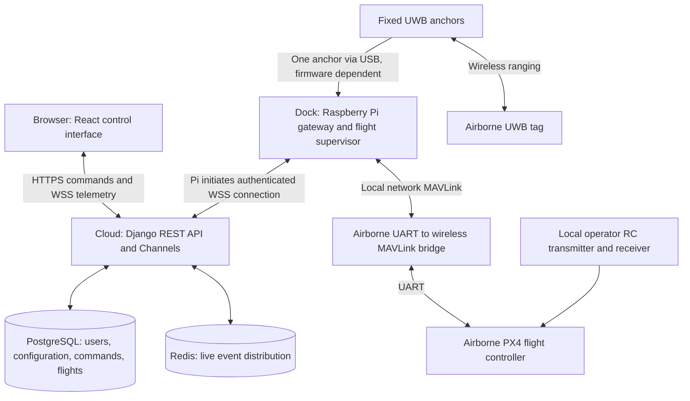

# Project Helios: system plan and inventory

Planning date: September 23, 2026. Team: two electrical engineers (EE1, EE2) and two computer engineers (CE1, CE2). This is a proposed implementation plan, not a verified shopping cart.

## 1. Intended demonstration

An authorized user opens projecthelios.dev, sees the system's actual readiness and position, selects a destination in a configured indoor volume, and requests a flight. A Raspberry Pi at the dock validates the request against live hardware state and supervises takeoff, movement, return, descent, and landing. PX4 on the aircraft stabilizes the drone and controls its motors.

Carry forward the existing scope: one drone, one dock, roughly 10 × 10 × 10 ft of localization space, automatic return and landing, and **manual battery charging**. Use an empty, supervised flight area; obstacle avoidance, autonomous charging, multiple drones, outdoor flight, and video streaming are separate extensions. Usable flight volume is smaller than the room because the vehicle and its stopping distance need clearance.

The existing repository contains React/TypeScript/Vite, React Router, a simulated control screen, and a Django health endpoint. Authentication, hardware integration, production backend configuration, durable commands, and real telemetry still need implementation. The README describes Vercel frontend deployment; this plan does not verify the live deployment.

## 2. Architecture and responsibilities

The Pi stays at the dock. The aircraft carries a flight controller, tag, and radio bridge; it does not need a second Pi for the baseline. Internet carries high-level requests and downsampled telemetry. Localization and continuous flight supervision stay local. PX4 retains stabilization, estimation, motor outputs, and onboard failsafe handling.

Recommended deployment: retain Vercel for the static frontend; run Django as an always-on ASGI service on Render with PostgreSQL and a Redis-compatible service. Configure api.projecthelios.dev, TLS, backups, secrets, health checks, and origin rules. Render supports WebSockets; clients still need heartbeat and reconnect logic. Choose service tiers explicitly and account for their recurring cost. [Render documentation](https://render.com/docs/websocket)

## 3. Hardware inventory

Required means required for the proposed baseline; exact models remain subject to bench validation. Quantities cover one aircraft and dock.

### Dock and local network

| Item | Quantity | Specification or decision | Owner |
|---|---:|---|---|
| Raspberry Pi | 1 | Recommend Pi 4 Model B, 4 GB for the non-vision gateway; Pi 5 is an alternative if already available. Benchmark selected hardware. | CE1 |
| Model-appropriate regulated Pi power supply | 1 | Include sufficient USB peripheral power budget; do not power flight batteries through the Pi. | EE2 |
| Storage | 1 + spare | 32–64 GB high-endurance microSD and reader; log rotation and a recoverable image. SSD is optional. | CE1 |
| Enclosure and cooling | 1 set | Ventilated dock enclosure, strain relief, model-appropriate heatsink/fan. | EE2 |
| Landing platform | 1 | Flat, rigid, non-slip, sized from aircraft footprint plus measured landing error and margin. | EE2 |
| Local flight-enable control and status indication | 1 set | GPIO switch/button, LEDs, resistors, wiring. Arming inhibit is distinct from independent aircraft override. | EE2 |
| Router/access point with internet | 1 existing or new | Dedicated local network without client isolation/captive portal; outbound WSS permitted. Prefer wired Ethernet to Pi. | CE1 |
| Ethernet and USB data cables | As needed | Known data-capable cables, sufficient reach, secured connectors. | EE2 |
| Powered USB hub | Conditional | Only if port count or measured peripheral load requires it. | EE2 |
| Pi UPS or backup supply | Optional | Protects local service availability; it is not a substitute for PX4 failsafes. | EE2 |

### Indoor localization

| Item | Quantity | Specification or decision | Owner |
|---|---:|---|---|
| UWB anchor modules | 4 minimum; provision for 6 | Compatible multi-anchor ranging firmware; use non-coplanar placement and test actual geometry. | EE2 |
| Airborne UWB tag | 1 | Same compatible system; weigh complete assembly and check regulator, antenna placement, and current draw. | EE2 |
| Anchor supplies and cables | 4–6 sets | Stable wall power for normal operation; do not rely on unmonitored internal batteries. | EE2 |
| Anchor mounts | 4–6 | Rigid, surveyed antenna locations at varied heights; no moving tripods during tests. | EE2 |
| USB connection to collector anchor | 1 | Verify exact firmware exposes the complete tag-to-anchor range set here. | CE1 |
| Tag mount and power harness | 1 | Secure and separated from propellers and major interference sources. | EE1 |
| Survey equipment and reference markers | 1 set | Tape/laser measure, level, coordinate labels, ground-truth points and heights. | EE2 |

Makerfabs MaUWB Direct anchors and a MaUWB ESP32S3 tag are candidates from earlier research, not interchangeable with arbitrary DW3000 development boards. Confirm protocol, complete range-set rate, and mass before ordering the full set. See [hardware verification](../research/dock-hardware-verification.md) and [earlier UWB research](../research/python-uwb-integration.md).

### Aircraft and local operator control

| Item | Quantity | Specification or decision | Owner |
|---|---:|---|---|
| Small guarded frame | 1 | Fit room, payload, FC mounting, battery, tag, bridge, and range sensor. | EE1 |
| Brushless motors | 4 + spare | Matched to propeller diameter, battery voltage, total mass, and thrust requirements. | EE1 |
| ESC | 1 four-in-one or 4 individual | Correct voltage/current rating and PX4-compatible output protocol; include wiring/capacitor. | EE1 |
| Propellers and guards | Installed set + ≥2 spare sets | Correct shaft fit and rotation; guards must clear loaded props. | EE1 |
| PX4-supported flight controller | 1 | Kakute H7 Mini is a candidate; verify exact revision, firmware target, sensors, UARTs, and logging limits. | EE1 |
| IMU/barometer | Usually on FC | Verify onboard parts and PX4 drivers; don't purchase duplicate modules by default. | EE1 |
| Validated heading source | 1 solution | Supported external magnetometer is the baseline candidate; characterize indoor magnetic distortion. One UWB tag cannot measure yaw. | EE1/CE1 |
| Downward rangefinder | 1 | PX4-supported driver/interface, suitable minimum range, floor response and field of view. | EE1 |
| Airborne MAVLink radio bridge | 1 | Tested Wi-Fi-to-UART bridge plus firmware, antenna, regulator and harness. For telemetry-radio alternative, include a ground radio too. | CE1/EE1 |
| RC transmitter and batteries | 1 set | Local independent operator mode override. | EE1 |
| Compatible RC receiver | 1 | Verify receiver protocol, FC UART/inversion requirements and PX4 support. | EE1 |
| Flight batteries | 2–3 | Chemistry, cell count, discharge capability, mass and connector matched to propulsion. | EE1 |
| Balance charger and power supply | 1 set | Matched to battery chemistry/cell count, with correct main and balance leads. | EE1 |
| Power distribution and voltage regulation | 1 set | May be integrated with ESC/FC; document every rail, connector and current budget. | EE1 |
| Voltage/current measurement | 1 solution | Integrated or supported external sensing; calibrated for low-battery behavior. | EE1 |
| Landing feet, mounts, straps and harness | 1 set + spares | Vibration isolation, fasteners, heat shrink, wire, connectors, cable restraint. | EE1 |

Do not finalize motor/ESC/battery/frame models independently. Produce a mass budget, peak/hover power budget, thrust check, connector pinout and UART allocation first. A supported CPU family does not establish PX4 board compatibility. A magnetometer that fails in the room requires a new heading solution and schedule/budget revision.

### Shared equipment and facilities

- Development computers; an Ubuntu workstation or compatible VM for the selected PX4 simulation environment.
- Soldering station, solder, flux, fume extraction, crimping tools, cutters, tweezers, hex drivers and multimeter.
- Current-limited bench supply, smoke stopper/current limiter, oscilloscope or logic analyzer, and USB-to-UART adapter with correct logic voltage.
- ST-Link programmer and appropriate leads if the selected MaUWB STM32 firmware must be upgraded; confirm board access and vendor flashing procedure.
- Scale, calipers, measuring tape, level, fabrication access (3D printer/laser cutter or basic shop), mounting materials and fasteners.
- Approved flight enclosure/netting and room access; designated operator and observer; lab battery handling/storage provisions and PPE.
- Spare props, motor, connectors, storage card and cables; label maker/tape and a camera/phone for trial recordings.
- Git hosting, deployment accounts, domain/DNS access and shared issue tracker. Record account ownership and recovery access.

## 4. Software, frameworks and libraries

Keep the existing stack. Install new dependencies only when their subsystem is implemented; pin tested versions and commit lockfiles.

| Layer | Baseline | Purpose/status |
|---|---|---|
| Frontend | React, TypeScript, Vite, React Router, CSS/SVG | Already present; retain current room view, replace simulation with measured state. |
| Browser HTTP/live connection | Native fetch and WebSocket | Enough for this scope; implement reconnect, schema checks, stale state and error handling. |
| Optional frontend helpers | TanStack Query; Zod | Add if server-state caching or runtime schema validation reduces custom code; not mandatory dependencies. |
| Backend | Python, Django | Present; users, permissions, configuration, command lifecycle and admin. |
| HTTP API | Django REST Framework | Proposed serializers, validation and permissions; plain Django is possible, but choose one consistent API approach. |
| WebSocket server | Channels, channels_redis, Daphne | Proposed ASGI application and cross-process live events. |
| Production persistence | PostgreSQL, psycopg | Durable records; existing SQLite stays useful for lightweight local development. |
| Live event transport | Redis | Channels distribution; never the only durable record of accepted flight commands. |
| Dock OS | Raspberry Pi OS Lite 64-bit | Headless service host; verify Python and ARM64 dependency availability. |
| Dock runtime | Python, asyncio, systemd, journald | Long-running gateway, bounded tasks, automatic startup, watchdog and logs. |
| UWB I/O | pyserial | Device-specific serial parser with bounded reads and timeouts. |
| Localization | NumPy, scipy.optimize.least_squares | 3D multilateration, calibration, robust residuals and quality checks. |
| Dock/cloud connection | websockets; Pydantic | WSS client, explicit message schemas and runtime validation. |
| Flight commands | MAVSDK Python native bindings | Proposed offboard commands/telemetry; pin API generation and bench-check Python/ARM64. Legacy gRPC versions additionally require mavsdk_server. |
| External position messages | pymavlink | Send the chosen PX4-compatible external-position message with correct frames, times and uncertainty. |
| MAVLink routing | mavlink-router, if multiple consumers | Separate endpoints for SDK, position injection, logging and QGroundControl; one command authority. |
| GPIO | gpiozero, compatible backend | Flight-enable switch and status lights; validate selected Pi/OS support. |
| Airborne autopilot | PX4 stable release, pinned | Flight estimation and control, configuration and failsafes. |
| Configuration tool | QGroundControl | Firmware setup, calibration, parameter export and bench diagnostics on a development computer. |
| UWB/bridge firmware tools | Vendor flasher; Arduino IDE or PlatformIO if required | Pin firmware and configuration; customize only where transport requires it. |
| Simulation | PX4 SITL and compatible Gazebo release | Simulated aircraft, offboard workflow and failure injection on development hardware. |
| Testing | Django tests; pytest for gateway; Playwright for browser | Add pytest-asyncio if needed; replay captured UWB packets and test disconnected hardware paths. |
| Development | Git, pnpm, uv, Node.js, Ruff, Oxlint, TypeScript | Existing tooling; GitHub Actions or equivalent for CI. |
| Deployment | Docker for cloud if useful; systemd for Pi | Reproducible ASGI image and explicit migrations; simple supervised Pi service. |
| Analysis | NumPy, Matplotlib; pandas if needed | Localization error, landing dispersion, latency and availability plots. |
| Monitoring/storage | Structured logs, uptime checks, backups; optional Sentry/object storage | Preserve command/fault history and downloadable test logs. |

Channels' production cross-process layer uses Redis; its in-memory layer cannot distribute events between worker processes. [Channels documentation](https://channels.readthedocs.io/en/latest/topics/channel_layers.html) DRF provides the API framework; verify its supported Django/Python versions when locking dependencies. [DRF documentation](https://www.django-rest-framework.org/) SciPy supports bounds and robust losses for least-squares fitting. [SciPy documentation](https://docs.scipy.org/doc/scipy/reference/generated/scipy.optimize.least_squares.html)

The backend currently pins Python 3.14. The gateway should have its own pyproject.toml and lockfile: do not assume every flight/serial/scientific package supports that Python version on ARM64. Keep web and gateway protocol-compatible even if their Python runtimes differ. ROS 2, Kubernetes, MQTT, Celery, a custom flight controller, and a custom UWB PCB are not baseline requirements. Avoid introducing a second cloud transport alongside WSS without a concrete need.

Current MAVSDK documentation describes native Linux aarch64 wheels, including 64-bit Raspberry Pi OS; older gRPC examples use a different deployment/API. Select one generation and test the needed offboard and telemetry functions on the Pi. [MAVSDK quickstart](https://mavsdk.mavlink.io/main/en/python/quickstart.html)

## 5. Work that libraries will not implement for us

### Gateway and localization

Create apps/gateway with separate modules for UWB transport/parser, calibration/solver, coordinate transforms, PX4 adapter, flight state machine, cloud client, configuration and logging. Run hardware ownership in one supervised gateway instance; prevent duplicate serial/MAVLink owners. Keep cloud I/O and uploads from blocking the local control path, and bound queues and log storage.

Survey anchor antenna centers, calibrate range biases, convert all values to meters, associate ranges with their actual measurement epochs, and reject malformed/stale/incomplete measurements. Measure geometry, residuals, latency, dropouts, and independent position error. If readings are sequential, account for time skew while the aircraft moves. Record antenna-to-aircraft reference-point offset.

PX4's external-position guide calls for roughly 30–50 Hz message streaming and requires correct frames, timestamps and estimator configuration. Its offboard keepalive is a separate requirement, with a 2 Hz minimum described in the guide. Plan a 20 Hz setpoint loop and a validated 30–50 Hz external-position path; benchmark both. Those are different streams. Do not forward repeated old ranges with new timestamps to appear faster. If the UWB system cannot meet the selected PX4 estimator requirements, change the localization design or demonstrate a properly modeled estimator before flight. [External-position guide](https://docs.px4.io/main/en/ros/external_position_estimation), [offboard guide](https://docs.px4.io/main/en/flight_modes/offboard)

Use room coordinates with Z up and meters in every application payload. Define the full rotation/translation into the selected PX4 local frame, including heading and height reference; merely negating Z is insufficient in general. Convert feet only at the UI boundary. Configure position fusion without pretending a single UWB tag supplies measured attitude or velocity. Preserve covariance/quality and actual acquisition times.

### Command path

1. Operator signs in and obtains the single active control lease for this aircraft.
2. Browser submits a high-level command over HTTPS. Backend checks identity, permission, lease, configured bounds, type, schema and expiry.
3. Backend commits a command record before notifying the Pi over its outbound WSS connection. It reports accepted/pending, not successful flight.
4. Pi independently checks command ID, expiry, active configuration revision, lease/session generation, local flight enable, battery, link, estimator and flight state.
5. Pi acknowledges acceptance or rejection and owns execution. It limits acceleration/speed and supervises all transitions locally.
6. Actual telemetry and command outcomes flow back to the cloud and browser. Reconnection reconciles state; it does not automatically replay old movement commands.

Command fields: schema version, UUID, aircraft/dock ID, command type, parameters, meter-based frame ID, issue/expiry times, control-lease generation, and room/configuration revision. Telemetry includes boot/session ID, sequence, sample time, last-command ID, measured position, target, flight state, battery, localization age/quality, link health and fault reason. Use UTC for audit times and monotonic clocks for local durations; define clock-skew handling. Transport delivery is not exactly-once physical execution: deduplicate, persist local outcomes, and treat a crash during execution as unknown until reconciled.

Suggested states: OFFLINE → DISARMED → READY → TAKING_OFF → MOVING → HOLDING → RETURNING → LANDING → DISARMED, with explicit FAULT/ABORT paths. Separate dock connectivity from aircraft flight state. Confirm arrival from measured position and settling criteria, and landed/disarmed from aircraft feedback. Define HOLD, RETURN and LAND separately; a web “stop” action must not mean cutting motors in the air. Block geometry/calibration changes during an active flight.

### Backend and UI

Data records: users/roles, rooms, anchors, docks/device credentials, aircraft, configuration revisions, control leases, flights, commands, acknowledgments, fault events and log references. Keep full-rate logs local and upload after flight; persist sampled telemetry in the cloud with retention limits. Initial UI update target: 5–10 Hz, independently of the flight loop.

Suggested endpoints: current session/login/logout; rooms/configuration; dock/aircraft status; control-lease acquire/release; command creation/detail; flight history/detail/log download. Separate browser and device WebSocket endpoints and authentication. Use Django session authentication with secure cookies/CSRF for browser requests, explicit CORS/CSRF and WebSocket origin allowlists for the chosen domains, and distinct revocable device credentials for the Pi. Store no deployment secrets in Vite public variables.

UI must show measured and commanded positions separately, actual battery/readiness/faults, telemetry age, command pending/accepted/executing/completed/rejected states and an explicit simulation indicator. A closed browser does not stop the local supervisor. Simulation animation and reduced-motion settings must never fabricate vehicle movement or completion. Replace the mock corner dock at (0,0,0) with surveyed coordinates and physical clearance.

### Failure policy to implement and verify

| Event | Required behavior |
|---|---|
| Browser closes | Gateway retains ownership of the active sequence; no new command arrives implicitly. |
| Cloud/internet lost | Reject new remote starts; after configured timeout use locally tested return/land policy only while position and path remain valid. |
| Localization invalid | Stop accepting movement and enter validated estimator-loss response; do not attempt blind dock return. |
| Pi crashes or local MAVLink lost | Onboard PX4 handles configured loss response independently of the Pi. |
| Battery low | Use measured thresholds and validated land/return policy; critical level must not start a long return. |
| Duplicate, expired or conflicting command | Reject/deduplicate; log a reason; never execute twice because of a reconnect. |
| Gateway restarts | Read actual aircraft state, invalidate stale authority, reconcile records; do not re-arm or resume automatically. |
| Local operator overrides | RC mode override takes priority; gateway relinquishes autonomous command authority. |

Implement these as explicit transitions with measured timeout values after bench/SITL validation. Position hold itself requires a valid estimate. The physical emergency control must have a defined effect and independent aircraft path; a button that only depends on the Pi/cloud is not an independent override.

## 6. Team ownership and handoffs

| Person | Primary work | Required handoff |
|---|---|---|
| EE1 — aircraft/power | Propulsion sizing, wiring, FC/ESC/sensor/RC assembly, battery system, PX4 calibration, flight readiness | Mass/power budget, wiring and port map, parameter export, repeatable operator-controlled aircraft test |
| EE2 — dock/localization hardware | Dock design, Pi power/enclosure, UWB mounts/firmware/survey, flight-enable electronics, fabrication | Surveyed anchor/dock coordinates, firmware manifest, raw range recordings and electrical acceptance results |
| CE1 — embedded integration/flight software | Pi setup, UWB parser/solver, frame/time alignment, MAVLink integration, state machine, failsafes and local logs | Gateway that passes replay/SITL/bench tests and a documented device protocol |
| CE2 — cloud/frontend | Django API/auth/storage, WSS, deployment, React real telemetry/commands, CI and browser tests | Hosted system working against a simulated gateway, with command lifecycle and permissions |

Pair EE2+CE1 for positioning, EE1+CE1 for flight integration, and CE1+CE2 for the protocol. CE1 is the likely workload bottleneck: CE2 should own the gateway simulator/protocol fixtures and EE2 should own repeatable localization data collection. All four participate in integration and test reviews. Each subsystem needs a second teammate able to reproduce its setup.

## 7. Delivery gates and definition of done

Retain the [day-by-day roadmap](../project-roadmap.md), November 1 demonstration target and November 16 submission deadline. Dates are targets; readiness gates control flight progression.

| Target | Gate and evidence |
|---|---|
| Sep 25 | BOM candidate compatibility, mass/power/port budget, delivered quotes, role ownership and procurement lead times recorded |
| Oct 4 | Hosted browser → simulated gateway → acknowledged outcome → actual simulated telemetry; permissions and expiry tested |
| Oct 11 | Surveyed handheld UWB trials throughout the usable volume, including dock height; measured error/rate/latency/dropouts |
| Oct 18 | Frames and estimator verified with props removed; repeated supervised hover/landing and RC override verified |
| Oct 25 | Browser-requested destination and local dock return/landing demonstrated repeatedly |
| Nov 1 | Cold-start end-to-end demonstration recorded; feature freeze |
| Nov 8 | Failure matrix, repeatability data, wiring, operating guide and setup reproduction complete |
| Nov 16 | Report, slides, source, configuration, BOM, logs/results and backup video submitted |

Proposed acceptance targets, to freeze with the team before testing: 95th-percentile static horizontal error ≤0.15 m and vertical error ≤0.20 m; waypoint arrival within 0.25 m for two seconds; at least 9 successful full-pad landings in 10 recorded trials with no boundary breach; valid command acknowledgment within one second under the test network. These are project targets, not UWB product guarantees or sufficient flight-safety criteria. Require the actual error distribution, vehicle radius, overshoot and stopping distance to fit the room margins; revise the design if they do not.

Measure dynamic error and dropout duration as well as static error. Use independently surveyed reference points and recordings, not two displays of the same estimate. Choose a pad whose usable half-width exceeds vehicle half-width plus measured landing dispersion and margin. Test each failure path in simulation/bench conditions first, including broker restart, Pi restart, corrupt serial data, stale position, invalid axis transforms, expired commands and duplicate delivery.

## 8. Budget and remaining design decisions

Earlier research estimated $770–$1,095 for aircraft, four-anchor localization, RC, charging equipment, basic pad and consumables, **excluding a dedicated Pi kit**. Add a provisional $100–$180 Pi/power/storage/enclosure allowance: roughly **$870–$1,275 hardware**, before new lab equipment, enclosure, router, optional sensors, hosting and additional anchors. This is arithmetic on older planning allowances, not current supplier pricing or a delivered quote. The earlier four-to-six-anchor allowance added about $86; refresh all listings and avoid double-counting shared dock cabling. Maintain a 15–20% contingency when replacing allowances with quotes.

Budget frontend/backend service plans, PostgreSQL, Redis, domain renewal, backups/log storage, shipping/taxes, replacement parts and fabrication. Existing university equipment and credits should be listed as borrowed/provided, not silently treated as purchased for $0. An $800 ceiling probably requires borrowed hardware or scope/funding changes.

Before placing final orders, record: exact aircraft/FC/firmware combination; matched propulsion and measured payload budget; heading and range sensor models; UWB firmware/protocol/rate; UART and power allocations; local radio/network design; physical room/dock geometry; hosting tiers; agreed acceptance limits. Select the smallest viable prototype combination and test its highest-risk interfaces early. Exact motor, frame, rangefinder and bridge SKUs remain open because a compatible assembly has not yet been demonstrated.

If automatic charging becomes a requirement, add dock and aircraft contacts, alignment/capture, charger/controller appropriate to the battery and balance needs, power/contact/temperature sensing, landed and disarmed interlocks, protected power switching and an independently tested charge state machine. Camera/AprilTag alignment, optical flow, extra anchors and an onboard companion computer are conditional additions if measured navigation performance demands them; each changes mass, software, budget and schedule.

## 9. Required project artifacts

Maintain a requirements/acceptance matrix, reviewed BOM with quantities and delivered cost, mechanical drawing, wiring/pinout diagram, mass/power budgets, room/anchor survey, API/message schema, state/failure diagram, versioned firmware and PX4 parameters, provisioning/recovery scripts, deployment configuration, test fixtures/results, operating checklist, issue/risk register, final report/slides and backup demonstration video. No purchased library replaces these integration deliverables.
