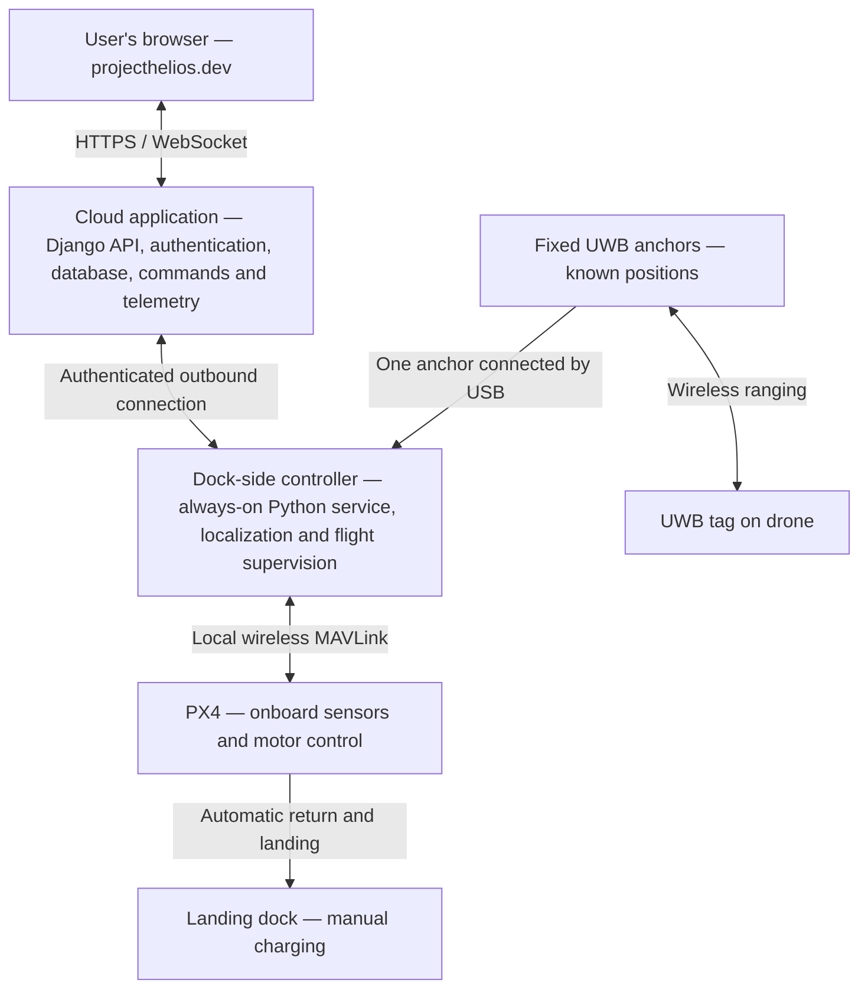

# Project Helios: Day-by-day roadmap

Planning date: September 23, 2026  
Submission deadline: November 16, 2026  
Available time: 55 calendar days, including the start and deadline dates

Target a complete working demonstration by **November 1**, leaving two weeks for reliability, documentation, and presentation.

## Scope and assumptions

Project Helios will let an authorized user log into `projecthelios.dev`, select a destination within a configured 10 × 10 × 10 ft indoor localization area, and command a PX4 drone to fly there and return to its dock. Return and landing are automatic; charging is manual.

The system consists of a cloud-hosted Django backend and website, a permanently installed dock-side controller, fixed UWB anchors, and a PX4 drone carrying a UWB tag. No laptop is required during normal operation. Hardware choices remain provisional.

This is an aggressive schedule. It assumes hardware arrives around October 5, teammates can work on hardware and software concurrently, and weekends are available for lighter work or catch-up. Dates are targets; physical flight must wait until preceding checks pass.

The hardware budget target is $800 with some flexibility. The earlier $770–1,095 planning estimate assumed an existing laptop. It must be updated to include the dedicated controller and reconcile delivered costs. Domain and hosting costs also need accounting.

## System architecture

The cloud manages users and requests. The dock-side controller handles continuous hardware communication. PX4 stabilizes the drone. The USB anchor data path must be verified for the selected boards and firmware.

## September 23–27: Lock the design and order hardware

| Date | Daily deliverable |
|---|---|
| Sep 23 · Wed | Confirm requirements, team responsibilities, deadline, and minimum demonstration: take off, reach one destination, return, and land. |
| Sep 24 · Thu | Finalize compatible hardware candidates. Check PX4 support, payload, interfaces, dock-side computer, and total delivered cost. |
| Sep 25 · Fri | Order approved parts and identify backup suppliers. Reserve the flight space, lab tools, and test enclosure. |
| Sep 26 · Sat | Measure the room. Draw proposed anchor positions, dock location, coordinate axes, and permitted flight boundaries. |
| Sep 27 · Sun | Agree on measurable acceptance targets for positioning, arrival error, landing success, and flight duration. Record unresolved risks. |

**Checkpoint:** hardware ordered, scope fixed, and budget reconciled, including the dedicated controller.

## September 28–October 4: Build the software foundation

| Date | Daily deliverable |
|---|---|
| Sep 28 · Mon | Create frontend, Django, and gateway project structure. Establish shared configuration and development instructions. |
| Sep 29 · Tue | Implement login, system permissions, and database records for rooms, anchors, docks, flights, and commands. |
| Sep 30 · Wed | Define command and telemetry formats, including IDs, timestamps, expiration, units, and coordinate frames. |
| Oct 1 · Thu | Deploy a basic Django application and frontend. Configure the domain, HTTPS, and WebSocket-capable hosting. |
| Oct 2 · Fri | Connect a simulated gateway to the cloud using device credentials. Display online/offline status. |
| Oct 3 · Sat | Build the room view with anchor markers, simulated drone position, destination inputs, and altitude selection. |
| Oct 4 · Sun | Demonstrate browser → Django → simulated gateway → browser. Verify command acknowledgments and rejection of invalid destinations. |

**Checkpoint:** the online application works with simulated telemetry, independently of hardware delivery.

## October 5–11: Bring up hardware and measure localization

| Date | Daily deliverable |
|---|---|
| Oct 5 · Mon | Inventory and inspect hardware. Configure the dock-side computer and automatic service startup; resolve missing parts immediately. |
| Oct 6 · Tue | Configure UWB firmware and collect raw range reports through one USB-connected anchor. Save representative recordings. |
| Oct 7 · Wed | Mount and survey anchors. Implement the correct parser, unit conversion, and missing/stale-measurement detection. |
| Oct 8 · Thu | Implement the 3D position solver and calibration. Validate it against recorded data and known physical points. |
| Oct 9 · Fri | Move the tag by hand throughout the room. Measure horizontal/vertical error, latency, and dropouts. Adjust anchor placement. |
| Oct 10 · Sat | Show real UWB position on the hosted website. Verify room axes and altitude match physical movement. |
| Oct 11 · Sun | Review localization results. Decide whether four anchors suffice or two additional anchors are necessary. |

**Checkpoint:** trustworthy handheld 3D tracking. If it fails, prioritize localization over interface polish. Compare against independently measured positions; agreement between displays using the same UWB data does not establish accuracy.

## October 12–18: Integrate PX4 and achieve stable hover

| Date | Daily deliverable |
|---|---|
| Oct 12 · Mon | Complete drone assembly and PX4 configuration. Check wiring, sensor orientation, motor mapping, and operator override with propellers removed. |
| Oct 13 · Tue | Establish the local wireless MAVLink connection. Record battery, attitude, flight mode, and connection health. |
| Oct 14 · Wed | Send external position estimates to PX4. Check timestamps, coordinate transforms, heading alignment, and estimator behavior. |
| Oct 15 · Thu | Move the drone manually with propellers removed. Confirm PX4 tracks every axis correctly and detects stale localization. |
| Oct 16 · Fri | Exercise movement, return, and failure behavior in simulation. Confirm physical-system configuration and readiness for flight. |
| Oct 17 · Sat | Attempt short, supervised takeoff–hover–landing tests only if readiness checks pass. Review logs after each attempt. |
| Oct 18 · Sun | Correct issues and repeat hover tests. Record stability and landing results; use this day as recovery time if needed. |

**Checkpoint:** repeatable controlled hover and landing. Do not proceed to remote waypoint flight without this.

## October 19–25: Add waypoint flight and dock return

| Date | Daily deliverable |
|---|---|
| Oct 19 · Mon | Command one small horizontal movement from the local service. Measure tracking error and overshoot. |
| Oct 20 · Tue | Test altitude changes and several destinations. Establish conservative speed limits and boundary margins. |
| Oct 21 · Wed | Connect website destination requests to the real gateway. Add readiness checks, command expiration, and single-user control ownership. |
| Oct 22 · Thu | Complete the first website-commanded flight with an on-site operator and locally enabled flight area. |
| Oct 23 · Fri | Implement return to an approach point above the dock. Verify approach height and path clearance. |
| Oct 24 · Sat | Add settling, descent, touchdown confirmation, and disarming. Begin repeated dock landings. |
| Oct 25 · Sun | Review landing error and adjust pad size or approach behavior. Repeat the complete takeoff → destination → return → land sequence. |

**Checkpoint:** the core project works end to end. Charging remains manual.

## October 26–November 1: Make the demonstration dependable

| Date | Daily deliverable |
|---|---|
| Oct 26 · Mon | Test invalid destinations, repeated button clicks, simultaneous users, and attempts to command a busy drone. |
| Oct 27 · Tue | Test browser closure and cloud disconnection in simulation first, then controlled physical conditions where appropriate. |
| Oct 28 · Wed | Test stale UWB data and degraded localization. Confirm motion requests are blocked and the configured response activates. |
| Oct 29 · Thu | Validate low-battery, lost-MAVLink, and gateway-restart behavior. Use simulation or bench testing for hazardous cases. |
| Oct 30 · Fri | Complete flight logs, command history, and clear UI fault messages. Make failures diagnosable from saved data. |
| Oct 31 · Sat | Run the system from a cold start: power hardware, connect automatically, log in remotely, fly, return, and land. |
| Nov 1 · Sun | Run a full demonstration rehearsal and record a successful end-to-end video. Freeze the feature set. |

**Checkpoint:** complete demonstration available two weeks before submission.

## November 2–8: Evaluate and document

| Date | Daily deliverable |
|---|---|
| Nov 2 · Mon | Run a documented localization test across measured reference points and heights. |
| Nov 3 · Tue | Run repeated waypoint trials. Measure destination error, overshoot, and settling time. |
| Nov 4 · Wed | Run repeated dock-return trials. Measure landing error and success rate, including failed trials. |
| Nov 5 · Thu | Evaluate command latency, connection recovery, and the tested failure responses. Organize logs and results. |
| Nov 6 · Fri | Produce charts and write the results, limitations, and comparison against the original acceptance targets. |
| Nov 7 · Sat | Finish installation instructions, wiring diagrams, anchor layout, operating procedure, and final bill of materials. |
| Nov 8 · Sun | Have a teammate follow the instructions from scratch. Fix missing steps and confusing behavior. |

**Checkpoint:** measured results and reproducible setup, not just a successful one-off flight.

## November 9–16: Finalize and submit

| Date | Daily deliverable |
|---|---|
| Nov 9 · Mon | Finish the report draft: problem, requirements, architecture, implementation, testing, results, and limitations. |
| Nov 10 · Tue | Build presentation slides and a short demonstration script. Prepare explanations of UWB localization and cloud/local responsibilities. |
| Nov 11 · Wed | Conduct a timed rehearsal with questions. Identify unclear explanations and remaining defects. |
| Nov 12 · Thu | Fix only demonstration-blocking defects and rerun affected checks. Freeze hardware, firmware, and dependencies. |
| Nov 13 · Fri | Capture the final backup video and screenshots. Back up code, configuration, logs, and documentation. |
| Nov 14 · Sat | Buffer day for unexpected failures. Verify batteries, spare parts, mounts, network access, and transport arrangements. |
| Nov 15 · Sun | Final rehearsal and submission audit. Verify links, credentials, files, and the exact required submission format. |
| Nov 16 · Mon | Submit and present. Use the verified setup and recorded backup if the live demonstration is interrupted. |

## Milestones and scope control

| Target date | Milestone |
|---|---|
| October 11 | Validated handheld 3D tracking |
| October 18 | Stable hover and controlled landing |
| October 25 | Complete waypoint flight and dock-return sequence |
| November 1 | Recorded end-to-end demonstration; feature freeze |
| November 12 | Hardware, firmware, and dependency freeze |
| November 16 | Submission and presentation |

The critical dependency is localization → stable PX4 flight → waypoint control → dock landing. Website, cloud communication, and simulation can develop alongside that work.

If progress slips, reduce UI polish, saved-route features, and optional analytics first. Preserve localization validation, controlled flight, return/landing, and the final testing buffer.

## Related research

- [Hardware budget feasibility](research/px4-hardware-budget.md)
- [Python UWB integration](research/python-uwb-integration.md)
