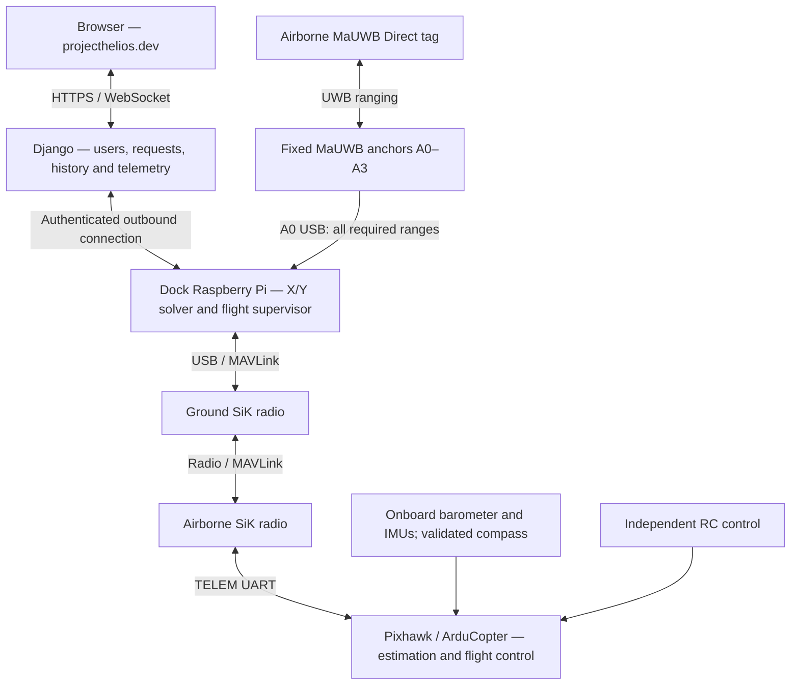

# Project Helios: Day-by-day roadmap

Planning baseline: September 23, 2026; revised September 24, 2026. Submission deadline: November 16, 2026. Planning window: 55 calendar days, including the start and deadline dates.

This roadmap implements [ADR-0001](adr/0001-uwb-sik-ardupilot-navigation.md). Target a complete working demonstration by **November 1**, leaving two weeks for reliability, documentation, and presentation. Dates are targets, not evidence that work is complete.

## Scope and assumptions

An authorized user logs into `projecthelios.dev`, selects a 3D waypoint inside the qualified operating volume, and requests a flight. A dock-side Raspberry Pi validates and supervises the request. Pixhawk running ArduCopter flies the aircraft using UWB-derived X/Y and onboard barometer-aided Z. The intended demonstration is takeoff → waypoint → return to the dock approach → controlled landing; charging remains manual.

The accepted aircraft is the Holybro S500 V2 development kit with Pixhawk. The ADR's implementation defaults are one airborne MaUWB Direct tag, four fixed MaUWB ESP32S3 anchors, a dock-side Raspberry Pi 4 Model B / 4 GB, and a matched SiK telemetry pair. One anchor exposes all required range data to the Pi over USB. Exact kit variant, radio band, firmware, power arrangements, and interfaces require commissioning records.

The previous 10 × 10 × 10 ft room is a candidate space, not an approved flight envelope for the S500. Survey the actual vehicle footprint, propeller clearance, stopping margins, and landing area before committing to that room. Automatic precision docking and precise floor clearance are not guaranteed by barometric altitude; landing performance must be measured. No downward rangefinder is included in this baseline.

The schedule assumes hardware arrives around October 5 and teammates can develop cloud software, simulation, and hardware integration concurrently. No laptop is required in normal operation; development and commissioning may use one. Flight milestones depend on passing the preceding checks even if that changes the dates.

The original $800 hardware target remains a budget constraint to reconcile, not a verified cost for this setup. Retire the earlier $770–1,095 estimate as a purchasing basis. By September 25, total the selected kit, four anchors, tag, Pi and accessories, radio pair if not fully included, batteries/charger, independent RC system, mounts, supplies, cables, shipping, and tax. Account separately for domain and hosting costs; record any funding gap before ordering.

## System architecture

The Pi sends external position observations and separate waypoint commands. Aircraft altitude and attitude return through SiK so the Pi can correct slant ranges and antenna offsets. The cloud never closes the localization or flight-control loop. A dedicated supervised Pi process owns the hardware interfaces independently of Django request workers.

The application uses east/north/up coordinates in metres relative to the dock survey. The aircraft adapter converts these to north/east/down and applies the dock-to-EKF-origin offset. Barometric Z is relative altitude, not measured floor clearance. One UWB tag provides no yaw; indoor compass performance is a flight prerequisite.

## September 23–27: Lock the design and order hardware

| Date | Daily deliverable |
|---|---|
| Sep 23 · Wed | Establish requirements, team responsibilities, deadline, and intended takeoff–waypoint–return–landing demonstration. |
| Sep 24 · Thu | Adopt ADR-0001. Record S500/Pixhawk, ArduCopter, MaUWB roles, Pi, and SiK as the baseline; identify exact kit variant, radio pair/band, and remaining procurement details. |
| Sep 25 · Fri | Reconcile the complete delivered bill of materials and funding gap; order approved parts and identify backup suppliers. Reserve suitable flight space and lab equipment. |
| Sep 26 · Sat | Measure the candidate room and aircraft clearance requirements. Draw anchor coordinates, dock datum, heading alignment, and proposed flight/landing boundaries; choose a larger space if needed. |
| Sep 27 · Sun | Define provisional X/Y error, barometric Z drift, waypoint arrival, landing, and flight-duration targets. Adopt the ADR's initial 20 fresh estimates/s and p95 latency under 100 ms as qualification targets; plan worst-gap and altitude-age measurements. |

**Checkpoint:** baseline recorded, procurement and budget reconciled, and a plausible operating area selected. Accuracy and timing targets remain unverified until measured.

## September 28–October 4: Build the software foundation

| Date | Daily deliverable |
|---|---|
| Sep 28 · Mon | Extend the existing frontend/Django workspace with a dedicated Pi service and shared configuration. Prepare an ArduCopter SITL development workflow. |
| Sep 29 · Tue | Implement login, permissions, and records for aircraft, rooms, anchors, docks, frame/survey versions, flights, and commands. |
| Sep 30 · Wed | Define command IDs, aircraft IDs, expiry, timestamps, units, uncertainty, frame versions, and telemetry health. Specify ENU-to-NED and dock/EKF offsets; separate observations from destinations. |
| Oct 1 · Thu | Deploy the application with HTTPS and WebSocket-capable backend hosting. Implement device authentication and the Pi's outbound connection. |
| Oct 2 · Fri | Connect a simulated Pi service and display readiness. Exercise external X/Y with barometric Z and compass yaw in SITL using the ADR's source selections. |
| Oct 3 · Sat | Build room/anchor views, simulated actual position, 3D destination input, and explicit altitude datum. Implement range/altitude replay fixtures and frame-transform checks. |
| Oct 4 · Sun | Demonstrate browser → Django → simulated Pi → ArduCopter SITL → telemetry. Test Guided local-NED position targets, acknowledgments/state transitions, invalid destinations, and initial disconnect handling. |

**Checkpoint:** software works in simulation before hardware arrival. The adapter uses `VISION_POSITION_ESTIMATE` for observations and `SET_POSITION_TARGET_LOCAL_NED` for 3D targets, as specified in ADR-0001.

## October 5–11: Bring up ranging, altitude feedback, and SiK

| Date | Daily deliverable |
|---|---|
| Oct 5 · Mon | Inventory exact hardware/firmware and power requirements. Configure Pi service startup, device identity, and logging. Begin S500 assembly and propeller-off Pixhawk commissioning. |
| Oct 6 · Tue | Pin compatible MaUWB firmware and forwarding software. Configure one tag/four anchors and prove that A0 USB exposes all four identified ranges. Record raw output, baud rates, and protocol. |
| Oct 7 · Wed | Mount/survey anchors, calibrate range bias, and record tag offset. In parallel, establish Pi USB → ground SiK → airborne SiK → TELEM UART; receive altitude, attitude, battery, mode, and health. |
| Oct 8 · Thu | Implement the X/Y solver using slant ranges and time-aligned aircraft altitude in the survey datum. Reject missing/stale ranges and altitude; propagate height uncertainty and compensate tag offset once. |
| Oct 9 · Fri | Move the propeller-off aircraft/tag assembly through measured points at multiple heights. Measure X/Y error, stationary Z drift, heading consistency, range age, and telemetry dropouts. |
| Oct 10 · Sat | Display real X/Y plus aircraft Z on the website. Verify axis signs, units, dock/EKF offsets, and altitude reference against independent measurements. Measure radio load and altitude age under concurrent traffic. |
| Oct 11 · Sun | Review geometry, four-range availability, update rate, and errors. Adjust placement or propose additional anchors if justified; document outstanding integration gaps. |

**Checkpoint:** measured horizontal localization with live barometric altitude feedback and a working bidirectional SiK link. This is not a UWB 3D solver. Do not substitute target height for measured height, or enable three-anchor flight without separate qualification.

## October 12–18: Qualify ArduCopter estimation and achieve stable hover

| Date | Daily deliverable |
|---|---|
| Oct 12 · Mon | Complete assembly, wiring/port map, mass/power checks, and pinned ArduCopter configuration. Verify sensors, motor mapping, heading, independent RC override, and EKF origin with propellers removed. |
| Oct 13 · Tue | Feed external X/Y over SiK. Inspect EKF logs for ExternalNav horizontal position, onboard barometric Z, and compass yaw; keep external Z/yaw and unmeasured velocity fusion disabled. |
| Oct 14 · Wed | Verify measurement timing, covariance, reset handling, and antenna/frame transforms. Measure acquisition-to-FC latency, fresh-estimate rate, worst gaps, and downlink altitude age with normal telemetry running. |
| Oct 15 · Thu | Exercise propeller-off manual motion and stale/outlier data. Verify source selection, frame stability, and rejection behavior; freeze initial speed, freshness, and clearance limits for flight trials. |
| Oct 16 · Fri | Test internet/UWB/altitude loss, SiK loss, Pi failure/restart, EKF/heading failure, RC loss, and battery responses in SITL or appropriate bench conditions. Verify onboard Land-oriented policies and heartbeat ownership; no automatic replay or unqualified RTL. |
| Oct 17 · Sat | If gates pass, perform short supervised takeoff–hover–landing trials. Measure motor-running barometric/heading behavior and review estimator and radio logs after each attempt. |
| Oct 18 · Sun | Correct issues and repeat hover/landing trials. Establish measured stability and vertical drift; retain this as recovery time if earlier gates fail. |

**Checkpoint:** repeatable controlled hover/landing, correct sensor fusion, and tested failure responses. Neither a healthy UI nor a minimum message rate alone qualifies waypoint flight.

## October 19–25: Add 3D waypoint flight and qualify dock return

| Date | Daily deliverable |
|---|---|
| Oct 19 · Mon | Command a small horizontal move locally in Guided mode. Measure error/overshoot and confirm observed motion matches the local-NED target. |
| Oct 20 · Tue | Test combined horizontal and altitude changes. Establish horizontal/vertical arrival tolerances, low-speed threshold, dwell time, speed/acceleration limits, and boundary margins from measurements. |
| Oct 21 · Wed | Connect website commands to the Pi's real flight state machine. Enforce live readiness, path clearance, local enable, frame version, expiry, idempotency, and single-user control ownership. |
| Oct 22 · Thu | Perform a supervised website-commanded 3D waypoint flight. Confirm actual arrival from telemetry rather than treating transmission or acknowledgment as completion. |
| Oct 23 · Fri | Implement return to a surveyed dock approach point and qualify its path and relative altitude. Do not assume an automatic RTL trajectory is suitable indoors. |
| Oct 24 · Sat | Test settling, descent, touchdown confirmation, and disarming over a sufficiently sized landing area. Record landing dispersion and barometric limitations. |
| Oct 25 · Sun | Repeat takeoff → waypoint → return → landing. Qualify dock landing only if measured error and clearance meet requirements; otherwise record the limitation and revise the pad/envelope or sensing decision. |

**Checkpoint:** end-to-end 3D waypoint flight and demonstrated return/landing behavior. Precision docking remains conditional on evidence; manual charging remains the baseline.

## October 26–November 1: Make the demonstration dependable

| Date | Daily deliverable |
|---|---|
| Oct 26 · Mon | Test invalid/out-of-volume destinations, obsolete frame versions, duplicate clicks, expired commands, simultaneous users, and busy-aircraft requests. |
| Oct 27 · Tue | Regress browser/cloud/internet loss. Confirm local supervision, rejection of new commands, the qualified landing policy, and no automatic resume after reconnection. |
| Oct 28 · Wed | Regress collector loss, missing ranges, stale altitude, outliers, and poor heading. Confirm invalid observations stop and waypoint progression is abandoned appropriately. |
| Oct 29 · Thu | Regress SiK loss, Pi power/process failure and restart, RC loss, and low battery in simulation/bench tests where appropriate. Confirm onboard action without a final Pi command; unrelated heartbeats must not mask supervisor failure. |
| Oct 30 · Fri | Complete replayable logs and UI fault messages: ranges, altitude age, uncertainty, estimator health, commands, and aircraft state. Check that telemetry display traffic does not starve navigation. |
| Oct 31 · Sat | Run a cold start, including warm-up, datum/frame verification, automatic service connection, local enable, and the qualified flight/return/landing sequence. |
| Nov 1 · Sun | Rehearse and record the complete qualified demonstration. Freeze features and publish any remaining limitations. |

**Checkpoint:** a recorded demonstration two weeks before submission, with performance claims limited to the tested operating envelope.

## November 2–8: Evaluate and document

| Date | Daily deliverable |
|---|---|
| Nov 2 · Mon | Evaluate X/Y against surveyed reference points at multiple heights; separately measure barometric Z error/drift and heading consistency. |
| Nov 3 · Tue | Repeat 3D waypoint trials; report horizontal/vertical arrival error, overshoot, settling time, and failures. |
| Nov 4 · Wed | Repeat dock-return/landing trials. Report landing dispersion and success rate, including failed trials; distinguish controlled landing from precision docking. |
| Nov 5 · Thu | Summarize fresh-estimate rate, latency percentiles/worst gaps, altitude age, packet loss, command latency, recovery, and failure responses. |
| Nov 6 · Fri | Produce charts and compare measured results against acceptance targets. Explain how barometric error and radio delay affect horizontal localization and flight limits. |
| Nov 7 · Sat | Finish wiring/port diagrams, anchor survey, coordinate transforms, firmware/parameter exports, operating procedure, delivered bill of materials, and installation instructions. |
| Nov 8 · Sun | Have a teammate reproduce setup and readiness checks from the documentation. Fix missing steps and confusing behavior. |

**Checkpoint:** reproducible setup and measured evidence for the ADR's qualification gates.

## November 9–16: Finalize and submit

| Date | Daily deliverable |
|---|---|
| Nov 9 · Mon | Finish the report: requirements, ADR, implementation, qualification evidence, results, and limitations. |
| Nov 10 · Tue | Prepare slides and a demonstration script explaining UWB X/Y, onboard barometric Z, SiK transport, and ArduCopter control. |
| Nov 11 · Wed | Conduct a timed rehearsal with questions; identify unclear explanations and remaining defects. |
| Nov 12 · Thu | Fix only demonstration-blocking defects and rerun affected checks. Freeze hardware, firmware, parameters, survey/frame versions, and dependencies. |
| Nov 13 · Fri | Capture final backup video/screenshots and back up code, configuration, raw data, logs, and documentation. |
| Nov 14 · Sat | Buffer for failures. Verify batteries, spare parts, mounts, network, and transport arrangements; re-survey if anchors move. |
| Nov 15 · Sun | Final rehearsal and submission audit: links, credentials, artifacts, qualified flight area, and required format. |
| Nov 16 · Mon | Submit and present using the qualified setup and recorded backup if the live demonstration is interrupted. |

## Milestones and scope control

| Target date | Milestone |
|---|---|
| September 25 | Baseline procurement and delivered budget reconciled |
| October 4 | Cloud-to-ArduCopter simulation workflow |
| October 11 | Measured UWB X/Y with live altitude feedback and bidirectional SiK |
| October 18 | Qualified estimator/failsafes, stable hover, and controlled landing |
| October 25 | 3D waypoint sequence and evaluated dock return/landing |
| November 1 | Recorded qualified demonstration; feature freeze |
| November 12 | Hardware, firmware, parameters, survey, and dependency freeze |
| November 16 | Submission and presentation |

The critical dependency is collector output + SiK altitude feedback → height-corrected X/Y → verified ArduCopter fusion and failure responses → stable hover → 3D waypoint control → qualified return/landing. Website and SITL work proceed alongside hardware commissioning.

If progress slips, reduce UI polish, saved routes, and optional analytics first. Preserve localization/altitude validation, failure testing, controlled flight, and the final evaluation buffer. If vertical accuracy, heading, room clearance, or link timing fails qualification, narrow the operating envelope or revise the ADR before advancing; additional anchors alone do not resolve every failure. Report any unmet dock-landing objective explicitly rather than claiming precision the sensors have not demonstrated.

## Related documents

- [ADR-0001: accepted architecture and qualification requirements](adr/0001-uwb-sik-ardupilot-navigation.md)
- [Project glossary](../CONTEXT.md)
- [Earlier system plan](planning/system-plan.md) — conflicting hardware and flight-stack assumptions are superseded by ADR-0001.
- [Earlier hardware budget research](research/px4-hardware-budget.md) — historical input, not the selected setup's current bill of materials.
- [Earlier Python UWB integration research](research/python-uwb-integration.md) — protocol background; its PX4 and full-3D recommendations are superseded.
