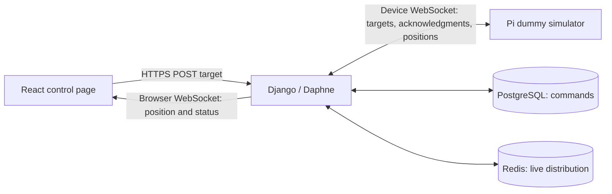

# Backend ↔ Raspberry Pi live data

Research date: 2026-10-02. Historical recommendations preceding implementation.
See [control setup](../control-setup.md) for the implemented flow and current
endpoints; deployed acceptance remains a separate verification step.
Scope: a user selects a target; the dock Pi receives it and returns dummy position
coordinates. No aircraft control or localization implementation is required.

## Recommendation

Use the existing Django Channels/Daphne backend as the WebSocket server and a
Python `websockets` asyncio client on the Pi. The Pi initiates one persistent
outbound `wss://api.projecthelios.dev/ws/device/` connection; both ends send JSON
messages over it. This avoids a public listener or inbound port forwarding on
the Pi. Keep the browser on Vercel and connect it directly to the API host.

Use HTTP POST for browser target submission and a separate browser WebSocket
for live position and command-status updates. HTTP makes validation, permissions,
CSRF protection and idempotent request responses straightforward. Sending browser
commands over WebSocket is also possible, but adds request/response correlation
without a clear benefit for occasional target selections. The backend–Pi link
remains fully bidirectional either way.



Channels provides JSON WebSocket consumers and cross-process channel layers;
the Python client supports asyncio, custom handshake headers, keepalive and
reconnection. These fit the repository's Python services without adding a
second backend framework. [Channels consumers](https://channels.readthedocs.io/en/stable/topics/consumers.html),
[channel layers](https://channels.readthedocs.io/en/stable/topics/channel_layers.html),
[Python client](https://websockets.readthedocs.io/en/stable/reference/asyncio/client.html).

## What already exists

Repository inspection found:

| Area | Current state and implication |
| --- | --- |
| Backend dependencies | `apps/backend/pyproject.toml` already includes Django 6, Channels/Daphne and channels-redis. |
| ASGI routing | `apps/backend/config/asgi.py` explicitly rejects WebSockets; authenticated routes and consumers must replace that branch. |
| Redis | Production uses `RedisChannelLayer`; local development defaults to an in-memory layer. Use real Redis for cross-process integration tests. |
| Deployment | `deploy/helios.service` runs Daphne behind `deploy/Caddyfile`. Live deployment is still recorded as unverified in ADR-0002. |
| Frontend | `ControlPage.tsx` manufactures current position with `requestAnimationFrame`; replace that source with Pi telemetry. |
| Pi | `apps/localization` is an empty Python scaffold with no working CLI. It can host the first dummy runner without implementing its hardware modules. |
| Authentication | Django users/sessions exist, but browser login APIs, device credentials and device permissions do not. |
| Units | UI coordinates are feet; ADR-0001 requires dock-relative east/north/up in metres. Convert at the UI boundary, or explicitly change the UI to metres. |

Evidence: [backend ASGI](../../apps/backend/config/asgi.py),
[settings](../../apps/backend/config/settings/local.py),
[control page](../../apps/frontend/src/pages/ControlPage.tsx),
[localization status](../localization.md),
[deployment ADR](../adr/0002-digitalocean-backend-foundation.md),
[coordinate and supervision contract](../adr/0001-uwb-sik-ardupilot-navigation.md).

## Alternatives

| Option | Assessment for this milestone |
| --- | --- |
| Native WebSocket + Channels | Recommended: matches installed infrastructure and the small bidirectional JSON exchange. Application code still owns acknowledgments and recovery. |
| MQTT 5 | Strong candidate for a larger device fleet, topic subscriptions and broker-managed sessions. Adds a broker, topic ACLs and a Django bridge now. QoS delivery does not prove a target was accepted or executed. |
| HTTP polling | Simple fallback, but server-to-Pi targets require repeated polling and a latency/load tradeoff. |
| SSE + HTTP | Reasonable browser alternative; SSE is server-to-client only, so it does not replace the bidirectional Pi connection. |
| Socket.IO | Adds its own protocol/client ecosystem; unnecessary when both ends can use ordinary WebSockets. |

Protocol evidence: [MQTT 5 specification](https://docs.oasis-open.org/mqtt/mqtt/v5.0/os/mqtt-v5.0-os.html),
[SSE directionality](https://developer.mozilla.org/en-US/docs/Web/API/Server-sent_events),
[Socket.IO protocol distinction](https://socket.io/docs/v4/).
The preference for Channels is an architectural judgment for this repo.

## First working vertical slice

1. Provision one device record and a revocable device credential. Add browser
   session login/CSRF handling and permission to control that device.
2. Pi connects and sends `hello` with protocol version, boot ID, simulation mode
   and frame version. Backend returns a connection session ID. Allow only one
   authoritative session per device; fence messages and commands from older sessions.
3. Browser submits `POST /api/devices/{id}/targets/` on an explicit send action,
   rather than on every slider or pointer movement. Include a client request ID
   for idempotency. Backend validates permission, coordinates and online state,
   persists the target, then attempts device delivery.
4. Pi validates the target and sends `target.ack`. For this milestone, acceptance
   means the dummy simulator accepted it, not that an aircraft moved.
5. Pi advances a deterministic dummy position toward the target and emits
   `position` at an initial 5 Hz. Backend forwards updates to authorized browser
   subscribers at `/ws/devices/{id}/events/`.
6. UI shows selected target, Pi-reported position, simulation label, connection
   freshness and command status separately. Its current pause/reset buttons must
   become explicit supported simulator commands or be disabled; they must not
   keep changing reported position locally.

Suggested code boundaries: a backend `devices` app for models, HTTP views,
consumers and a shared command service; a Pi transport module plus dummy runner
under `apps/localization`; a frontend API module and telemetry hook. Keep network
I/O separate from the future solver and hardware loop. Use one receiving task and
one bounded outgoing queue per Pi connection; prioritize acknowledgments over
replaceable position samples. Async consumers must use async ORM methods or
`database_sync_to_async` for synchronous database work.
[Channels database access](https://channels.readthedocs.io/en/stable/topics/databases.html).

## Proposed message contract

These fields and numerical defaults are design proposals, not library requirements.
All coordinates on the wire are metres in the surveyed dock ENU frame. A UI target
of `(5, 5, 5)` feet becomes `(1.524, 1.524, 1.524)` metres.

```json
{
  "v": 1,
  "type": "target.set",
  "command_id": "uuid",
  "session_id": "connection-uuid",
  "expires_at": "2026-10-02T15:00:10Z",
  "frame_id": "dock-enu-v1",
  "position_m": {"x": 1.524, "y": 1.524, "z": 1.524}
}
```

```json
{
  "v": 1,
  "type": "target.ack",
  "command_id": "uuid",
  "session_id": "connection-uuid",
  "status": "accepted"
}
```

```json
{
  "v": 1,
  "type": "position",
  "session_id": "connection-uuid",
  "boot_id": "boot-uuid",
  "seq": 42,
  "sampled_at": "2026-10-02T15:00:02Z",
  "frame_id": "dock-enu-v1",
  "position_m": {"x": 0.4, "y": 0.5, "z": 0.2},
  "simulated": true,
  "active_command_id": "uuid"
}
```

Reject unsupported versions/types, wrong sessions or frame versions, non-finite
coordinates, out-of-envelope targets and oversized payloads. Define rejection
reason codes. Derive device identity from credentials rather than trusting a JSON
device ID. Sequence numbers order samples within a boot/session; store backend
receive time separately from Pi sampling time. Clock synchronization and measured
clock error are needed before relying on device timestamps for physical data age.

## Delivery and reconnection

A successful socket send is not confirmation that the Pi accepted a target.
Channels distribution is at-most-once; group sends can drop messages when full.
Persist commands and status in PostgreSQL, with Redis used for live notification.
Do not treat a Channels group as a durable command queue.
[Channel-layer specification](https://channels.readthedocs.io/en/stable/channel_layer_spec.html).

Retain `channels_redis.core.RedisChannelLayer`. Renew group membership for
long-lived connections or deliberately cap connection lifetime below configured
group expiry; otherwise a healthy socket can stop receiving group traffic.
[channels_redis configuration](https://github.com/django/channels_redis).

For the first slice, reject new targets when the device is offline and permit
one unresolved target per device. Commit a command before dispatching it. Return
its ID even when subsequent delivery is uncertain; provide HTTP status lookup.
Suggested states are pending, accepted, rejected, expired-before-dispatch and
unknown. A timeout after dispatch becomes unknown, not proof of rejection.
Expire pending records that were never dispatched, including after a backend
crash between commit and notification. Resolve unknown records through state
reconciliation or an explicit operator decision before accepting another target.
On reconnect, reconcile the same command ID and Pi state; do not automatically
replay movement. Repeated IDs within a session return the cached acknowledgment
without restarting simulation. A Pi reboot invalidates that session. This keeps
the small demo honest without building a durable background delivery system yet.

The Python library supports ping/pong and retrying transient connection failures.
Configure explicit limits and jittered backoff capped around 30 seconds; do not
tight-loop on rejected credentials. Start with 20-second ping/timeout intervals,
but mark 5 Hz display telemetry stale after about 2 seconds independently of the
socket's status. Treat these as demo settings to tune, not flight thresholds.
Browser JavaScript needs application-level freshness/reconnect logic. On browser
reconnect, fetch current status and receive a latest-position snapshot, then
deduplicate subsequent events. Bound queues and discard obsolete telemetry
instead of replaying an old trajectory after an outage.
[Client reconnection](https://websockets.readthedocs.io/en/stable/reference/asyncio/client.html),
[keepalive](https://websockets.readthedocs.io/en/stable/topics/keepalive.html).

## Authentication and hosting

Use WSS and a per-device bearer credential in the Pi's handshake Authorization
header. Store a hash server-side, permit rotation/revocation, and keep the Pi
secret outside source control. Authorize before accepting the connection and
close sessions when credentials are revoked. Python `additional_headers` supports
this; the browser WebSocket constructor exposes URL/subprotocols, not arbitrary
Authorization headers. [Python client](https://websockets.readthedocs.io/en/stable/reference/asyncio/client.html),
[browser API](https://developer.mozilla.org/en-US/docs/Web/API/WebSocket/WebSocket).

For the browser, use Django sessions through `AuthMiddlewareStack`, verify device
permissions, and explicitly allow the frontend origins with `OriginValidator`.
HTTP CORS configuration alone does not protect WebSockets. The API host and
frontend origin differ, so blindly using the API's `ALLOWED_HOSTS` as the browser
origin list is insufficient. Keep device bearer-auth routing separate: a native
Pi client need not send a browser Origin header.
[Authentication](https://channels.readthedocs.io/en/stable/topics/authentication.html),
[WebSocket origin security](https://channels.readthedocs.io/en/stable/topics/security.html).

Use credentialed browser HTTP requests, an API CSRF-token endpoint and the CSRF
header for target POSTs. The production frontend and API share a registrable
domain, but arbitrary Vercel preview domains are cross-site; do not assume the
current Lax session cookie works for previews. Test the actual production origins.

Caddy reverse proxy supports WebSocket upgrades. Retain the existing Daphne
deployment and plan for reconnects on restarts/reloads. Add a Vite `/ws` proxy
with `ws: true` for local browser development; production browser sockets should
use the API host directly. A physical Pi cannot reach the developer laptop via
the Pi's own `localhost`; use an intentionally reachable LAN endpoint or the
deployed TLS endpoint. [Caddy](https://caddyserver.com/docs/caddyfile/directives/reverse_proxy),
[Vite proxy](https://vite.dev/config/server-options.html#server-proxy).

## Verification before calling the slice complete

- With a simulated Pi process, select a target in the browser; observe the exact
  converted target at the Pi, its acknowledgment in Django and changing Pi-origin
  coordinates in the browser. Confirm no browser animation invents actual position.
- Reject unauthorized users/devices/origins, malformed messages, frame mismatch,
  duplicate requests and out-of-range targets.
- Disconnect the Pi, kill the backend, interrupt Redis and reconnect both browser
  and Pi. Show stale/unknown states correctly and do not replay old commands.
- Exercise lost acknowledgments, duplicate command IDs, device reboot and two
  connections claiming the same device. Test a slow subscriber with bounded queues.
- Use Channels communicators for consumer tests and real Redis/Daphne/Caddy for
  transport integration. Finally run the same dummy client on the actual Pi with
  the repo's Python 3.14 requirement and the chosen locked dependency version.

No runtime code was changed or hardware tested during this research. The initial
rate and timeout values need measurement on the deployed path. This milestone
should remain explicitly simulated; the cloud connection must not become the
future aircraft stabilization or localization loop, as required by ADR-0001.
